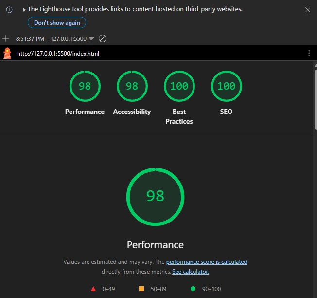

# Technical Documentation

## Project Overview
This project is a personal portfolio website developed as part of Assignment 3. 
The goal of the project is to practice basic web development concepts using HTML, CSS, and JavaScript.

In Assignment 3, the project was extended by adding interactive features, user feedback mechanisms, 
improved navigation, data storage using browser technologies, external API integration, 
project filtering and sorting, performance optimizations, and SEO improvements.

## Technologies Used

### HTML
HTML is used to structure the content of the website. Semantic elements such as `header`, `nav`, 
and `section` organize the page into meaningful sections including About, GitHub Repositories, 
Projects, and Contact. Form elements such as `input`, `textarea`, and `button` are used to collect 
user information in the contact form. Performance attributes such as `loading="lazy"` are applied 
to images, and `<link rel="preload">` tags are used to preload key images for faster loading. 
A `meta description` tag was also added to improve SEO.

### CSS
CSS is used to control the layout, appearance, and responsiveness of the website. The styling file 
defines the visual layout of the header, navigation menu, container elements, project cards, 
repository cards, filter buttons, sort button, and form elements. CSS is also used to implement 
hover effects, transitions, and the dark/light theme styles including dark mode support for 
all new elements added in later phases.

### JavaScript
JavaScript is used to add dynamic behavior and interactivity to the website. It handles tasks such 
as updating the greeting message based on the current time and visitor name, toggling project 
details when users click buttons, validating the contact form, displaying feedback messages, 
saving theme preferences using browser storage, filtering and sorting projects, and fetching 
GitHub repository data from an external API.

---

## Project Structure

The project follows a clear folder structure to separate different types of resources:

- `index.html`  
  The main webpage containing the structure and content of the portfolio.

- `css/styles.css`  
  Contains all styling rules for layout, typography, responsiveness, theme appearance, 
  filter buttons, sort button, and repository cards.

- `js/script.js`  
  Contains JavaScript code responsible for interactive features such as greeting messages, 
  theme toggling, project detail toggling, form validation, project filtering and sorting, 
  and GitHub API integration.

- `assets/images`  
  Stores image files used for project previews in the Projects section. 
  Images have been compressed using Squoosh to reduce file size and improve loading speed.

- `docs`  
  Contains documentation files including the AI usage report and technical documentation.

---

## Website Sections

### Header
The header introduces the website and contains the user's name, a short description, a greeting 
message generated by JavaScript, and a button to toggle the site theme. It also includes the 
main navigation menu.

### Navigation
The navigation bar allows users to quickly jump to different sections of the page. It uses anchor 
links connected to section IDs (`#about`, `#projects`, and `#contact`). Smooth scrolling is 
enabled through CSS to improve the browsing experience.

### About Section
This section contains a short introduction describing the author's academic background and goals.

### GitHub Repositories Section
This section dynamically fetches and displays the user's public GitHub repositories using the 
GitHub REST API. Each repository is displayed as a card showing the repository name, description, 
and a link to view it on GitHub. If the API request fails, a user-friendly error message is 
displayed instead.

### Projects Section
The Projects section displays individual project entries. Each project contains a title, an image, 
a button, and a hidden description. Projects can be filtered by category and sorted by scale.

JavaScript is used to toggle the visibility of the project descriptions when the user clicks 
the **View Details** button.

### Contact Section
The Contact section contains a form that allows users to submit their name, email, and a message. 
JavaScript validates the form inputs and provides feedback messages if the fields are incomplete 
or when the message is successfully submitted.

---

## Interactive Features

### Greeting Message
A greeting message is displayed in the header based on the current time and the visitor's name. 
JavaScript retrieves the current hour using the `Date` object and uses conditional statements to 
determine whether to display "Good morning", "Good afternoon", or "Good evening". The visitor's 
name is retrieved from `localStorage` if it has been saved previously, or the user is prompted 
to enter their name on their first visit. Both the time greeting and the name are combined into 
a single message such as "Good morning, Asma! 👋".

### Theme Toggle
A theme toggle button allows users to switch between light mode and dark mode. JavaScript adds 
or removes a CSS class (`dark-mode`) from the document body when the button is clicked.
The user's preference is stored using `localStorage`, so the selected theme remains active 
even after the page is refreshed.

### Project Filtering
Filter buttons above the projects list allow users to filter projects by category. The available 
categories are All, UI/UX, and Game. JavaScript reads the `data-category` attribute of each 
project card and shows or hides it based on the selected filter. The active filter button is 
highlighted to indicate the current selection.

### Project Sorting
A sort button allows users to sort projects by scale. Projects are assigned a scale value 
(Large or Medium) and sorted accordingly. Clicking the button toggles between Large → Small 
and Small → Large order. JavaScript reorders the project cards in the DOM based on their 
assigned scale values.

### GitHub API Integration
The GitHub Repositories section uses the GitHub REST API to fetch the user's public repositories 
dynamically. JavaScript sends a fetch request to the API endpoint, processes the response, and 
creates repository cards in the DOM. Error handling is included to display a user-friendly 
message if the request fails.

### Project Details Toggle
Each project includes a **View Details** button that reveals additional information about the 
project. JavaScript uses event listeners to detect button clicks and toggle the visibility of 
the corresponding description element.

### Contact Form Validation
The contact form includes client-side validation. When the user submits the form, JavaScript 
checks whether the name, email, and message fields contain values. If any field is empty, 
an error message is displayed. If all fields are filled, a success message is shown and 
the form is reset.

---

## Performance Optimizations
Several steps were taken to improve the loading speed and efficiency of the website:

- Images were compressed using Squoosh to reduce file size without visible quality loss
- The `loading="lazy"` attribute was added to all images so they only load when scrolled into view
- Key images are preloaded using `<link rel="preload">` in the HTML head to reduce initial load time
- Duplicate CSS properties were removed to keep the stylesheet clean and efficient
- A global `img` rule was added to handle responsive image sizing consistently across the page
- The site was tested using Lighthouse, achieving scores of 98 for Performance, 
  98 for Accessibility, 100 for Best Practices, and 100 for SEO
  

---

## Responsive Design
The website layout adjusts to different screen sizes using CSS. The container width changes for 
smaller screens, and flexible layouts ensure that elements remain readable and well-organized 
on mobile devices.

The `meta viewport` tag in the HTML file allows the layout to scale properly on mobile devices.

---

## SEO
A `meta description` tag was added to the HTML head to provide search engines with a concise 
summary of the page content. This improves how the page appears in search results and 
contributed to the SEO score in Lighthouse.
